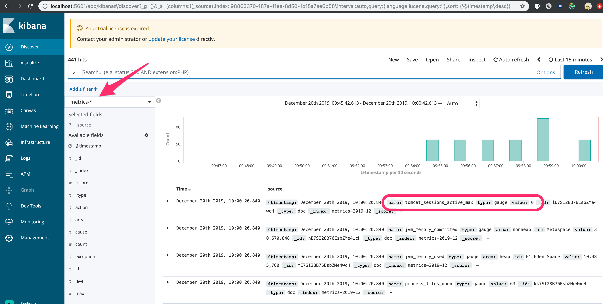

# micrometer-elastic

./gradlew bootRun

## start the server
Have a local ELK stack with an Elastic Server running on default url `http://localhost:9200`
`curl localhost:8080`

## send traffic every 5 seconds
`watch curl -v localhost:8080`
The server will respond with `hello' with a random response time between 0-4 seconds

## Kibana
Within Kibana you will be able to find the newly created `metrics-*` index

It will have many metrics of different types (gauges, timers, counters, etc.)

Eventually we will want to create dashboards from these metrics

## Publish to host other than localhost
The project contains an `application.properties` that can be updated to try and publish to different servers

Also, a manifest could be added to push to PCF
 

